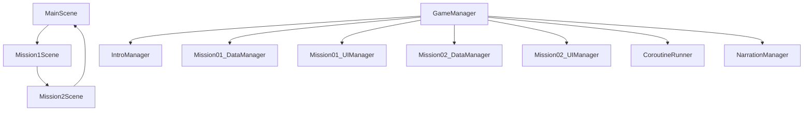

# 🕒 지금 몇 시일까요?

> **플랫폼:** Leia LUME PAD 2
> **대상:** 초등학교 1학년
> **엔진:** Unity 2022.3+ (C#)
> **목표:** 디지털-아날로그 시계 읽기, 시간 개념, 일상 활동 순서 학습을 돕는 몰입형 인터랙티브 콘텐츠

---

## 📁 프로젝트 구조

```
Assets/
├── Scripts/
│   ├── GameManager.cs
│   ├── IntroManager.cs
│   ├── Mission01_*.cs
│   ├── Mission02_*.cs
│   ├── NarrationManager.cs
│   ├── TouchObjectDetector.cs
│   ├── CoroutineRunner.cs
│   ├── SettingManager.cs
│   └── Utility/ (Clock, WordEnter, StringKeys 등)
├── Resources/
│   ├── Audio/ (SFX, Narration Clips)
│   ├── Prefabs/ (ClockTower, NPC, Particles)
│   └── Images/ (배경, UI 버튼 등)
├── Scenes/
│   ├── 00_Main.unity
│   ├── 01_FixTheClockScene.unity
│   └── 02_TimeOrderPuzzleScene.unity
```

---

## 🚀 실행 흐름



---

## 🧠 콘텐츠 구성

### 콘텐츠 ① 시계 바늘 맞추기 (FixTheClockScene)

* 디지털 시간 제시
* 아날로그 시계 3개 중 정답 시계 드래그하여 시계탑에 드롭
* 성공/실패 시 애니메이션 및 음성 피드백
* 총 3개 시계탑 수리 시 다음 미션으로 자동 이동

**사용 클래스**

* `Mission01_DataManager`, `Mission01_UIManager`
* `ClockTowerCtrl`, `WordEnter`, `TouchSelf`

---

### 콘텐츠 ② 하루 일과 정리하기 (TimeOrderPuzzleScene)

* 디지털 시간과 일러스트(기상, 양치 등) 제시
* 아날로그 시계 4개 중 정답 선택
* 정답일 경우 장면에 시계 삽입
* 총 6개 장면 랜덤 등장

**사용 클래스**

* `Mission02_DataManager`, `Mission02_UIManager`
* `Mission02_Clock`, `TouchObjectDetector`

---

## 🧩 주요 클래스 설명

| 클래스명                  | 역할 요약                        |
| --------------------- | ---------------------------- |
| `GameManager`         | 씬 전환, 게임 상태 및 터치 가능 여부 관리    |
| `IntroManager`        | 타이틀 텍스트 애니메이션, 시작 버튼 이벤트 처리  |
| `NarrationManager`    | 나레이션 음성 재생 + 자막 애니메이션 동기화 처리 |
| `TouchObjectDetector` | 터치 또는 마우스 입력 감지 및 선택 오브젝트 처리 |
| `WordEnter`           | 시계 간 충돌 감지 및 정답 판정 처리        |
| `ClockTowerCtrl`      | 시계탑 시계 설정 및 파티클 제어           |
| `SettingManager`      | 설정 팝업, 볼륨 토글, 3D 모드 전환       |
| `SoundManager`        | 음성/효과음 볼륨 조절 및 클립 로드         |
| `CoroutineRunner`     | 나레이션 등 코루틴 순차 처리 및 타임아웃 관리   |

---

## 🔊 오디오 / 나레이션 시스템

* 음성 클립은 `Resources/Audio/Narration/`에 저장

* 나레이션 자동 재생 예시:

  ```csharp
  yield return CoroutineRunner.instance.RunAndWait("mission1",
    NarrationManager.instance.ShowNarrationAuto("이제 우리가 시계를 다시 고쳐야 해요.", StringKeys.MISSION1_AUDIO4));
  ```

* 대사 키는 `StringKeys.cs`에 정의

---

## 🎞️ 연출 요소 (DOTween 기반)

* 타이틀 텍스트 웨이브 및 깜빡임 (`IntroManager`)
* FadeInOut 페이드 전환 (`GameManager`)
* 시계 드래그 후 Tween 되돌리기 (`TouchObjectDetector`)
* 자막 애니메이션 출력 (`NarrationManager.DOText`)

---

## ⚙️ 설정 기능

* 볼륨 조절: SFX/BGM 슬라이더
* 3D 모드 전환: `LeiaDisplay.Set3DMode(bool)`
* 재시작: `SceneManager.LoadScene`
* 종료: `Application.Quit()`

---

## 🧪 개발 환경

| 항목       | 세부 내용                               |
| -------- | ----------------------------------- |
| Unity 버전 | Unity 2022.3 LTS 이상                 |
| 디바이스     | Leia LUME PAD 2                     |
| 지원 SDK   | TextMeshPro, DOTween, LeiaUnity SDK |
| 입력 방식    | 터치 또는 마우스 드래그                       |
| 초기 실행 씬  | `00_Main`                           |

---

## 📝 기획/디자인 연계 사항

* 모든 장면에 친근한 **NPC(마법사)** 내레이션 포함
* 음성 + 자막 + 행동 피드백 통합 연출
* 학습 시 반복적 긍정 피드백 제공
* 엔딩: “정말 잘했어요! 다음에 또 만나요!” → 메인 화면 복귀

---

## 📸 대표 이미지

| 메인 화면                | 시계 바늘 미션            | 일과 시간 미션                |
| -------------------- | ------------------- | ----------------------- |
|  |  |  |

---

## 📚 라이선스 및 저작권

이 프로젝트는 ㈜엠씨미디어솔루션 교육 콘텐츠 개발 사업의 일부로 제작되었으며, 모든 저작권은 해당 기관에 귀속됩니다.

